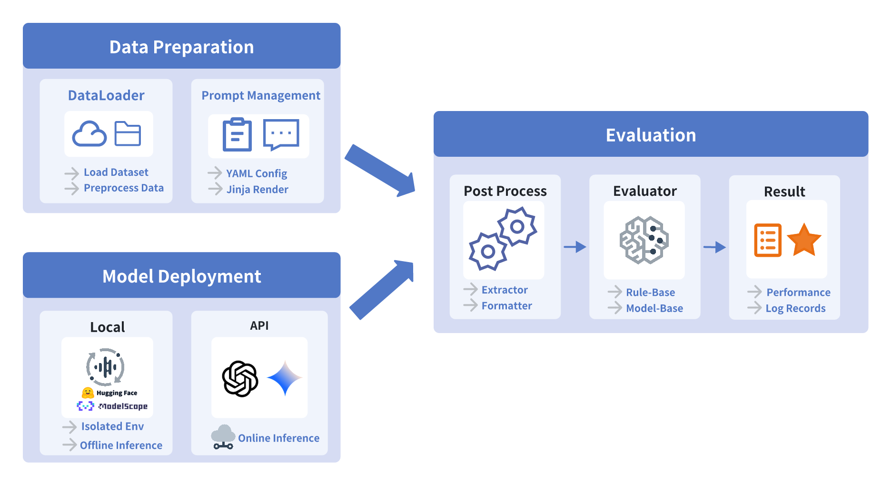

# VoxMatrix

统一的语音与音频模型评测框架。

[English](README.md) · [使用文档](docs/README.md) · [兼容性](COMPATIBILITY.md) · [第三方声明](THIRD_PARTY_NOTICES.md)

VoxMatrix 使用 Registry 统一管理数据集、模型、Prompt、Evaluator 和聚合策略，
并提供规范化的 Mesh Schema。框架覆盖语音识别、音频理解、语音生成、语音
Agent、说话人任务、安全评测和运行时指标。



## 核心能力

- 将 Hugging Face 音频数据集一次性转换为稳定 WAV 资产，后续评测直接复用。
- 对支持隔离运行的模型按每张 GPU 一个副本进行样本级数据并行；默认并发加载
  各模型副本。
- 在一个 Session 中复用同一个 Predictor 运行多个兼容 Benchmark，避免反复
  加载模型。
- 默认先加载全部待评测数据，再占用 GPU；支持断点续跑以及推理、后处理分阶段
  执行。
- 通过 YAML Registry 扩展数据集、模型、任务、Prompt、Evaluator 和聚合器。

本仓库不包含模型权重、完整数据集、生成音频或评测结果。

## 安装

需要 Python 3.10 或更高版本。

```bash
cd VoxMatrix
conda create -n voxmatrix python=3.10 -y
conda activate voxmatrix
pip install -e .
```

也可以使用 `uv`：

```bash
uv venv .venv --python 3.10
source .venv/bin/activate
uv pip install -e .
```

在源码目录中查看内置 Registry：

```bash
python cli/list_available.py --datasets
python cli/list_available.py --models
```

部分离线模型和 Evaluator 使用额外的隔离环境；其 Registry 配置会指定环境、
权重和依赖文件路径。

## 快速开始

运行一组已注册的数据集和模型：

```bash
voxmatrix \
  --dataset <dataset_name> \
  --model <model_name> \
  --limit 10
```

默认逐样本事件写入
`outputs/<model>/<dataset>/<timestamp>.jsonl`，聚合结果写入相邻的
`<timestamp>-overall.json`。可用 `--save <path>.jsonl` 指定其他路径。

### 一次性准备 Hugging Face 音频

建议在申请 GPU 前完成音频解码和 WAV 落盘：

```bash
voxmatrix-prepare \
  --dataset <dataset_name> \
  --output-dir prepared/<dataset_name>

voxmatrix \
  --dataset <dataset_name> \
  --model <model_name> \
  --prepared-manifest prepared/<dataset_name>/manifest.jsonl
```

准备目录中包含 WAV 资产、`manifest.jsonl`、`metadata.json` 和经过校验的
`_SUCCESS` 标记。详见[数据集文档](docs/datasets.md)。

### 每张 GPU 加载一个模型副本

支持模型池的隔离适配器可以把样本分发到独立模型副本：

```bash
CUDA_VISIBLE_DEVICES=0,1 voxmatrix \
  --dataset <dataset_name> \
  --model <model_name> \
  --use_model_pool on \
  --replicas 2 \
  --gpus-per-replica 1 \
  --inference-workers 2 \
  --model-startup-workers 2
```

`--use_model_pool auto` 是默认值，仅对兼容适配器自动启用模型池。除非显式
开启，否则禁止多个副本共享 GPU。调整副本数、GPU 分组和就绪策略前请阅读
[Session 与并行推理](docs/sessions.md)。

### 多 Benchmark 复用一个 Predictor

复制并修改 [examples/suite.example.yaml](examples/suite.example.yaml)，然后运行：

```bash
voxmatrix-suite --config examples/suite.example.yaml
```

Session 会先准备全部数据集，再构造一次模型，在多个 Benchmark 之间复用，并
在最后统一释放。

## 文档

- [数据集与一次性 WAV 准备](docs/datasets.md)
- [数据标注与 Manifest 构建](docs/annotation.md)
- [模型适配器与 Registry 配置](docs/models.md)
- [评测任务、结果和断点续跑](docs/tasks.md)
- [共享 Session 与多 GPU 推理](docs/sessions.md)
- [指标及 Evaluator 依赖](docs/metrics.md)
- [常见问题排查](docs/troubleshooting.md)

## 兼容性

`voxmatrix`、`voxmatrix-prepare` 和 `voxmatrix-suite` 是规范命令。为兼容
已有自动化，旧命令别名、`audio_evals` 与 `mesh_eval` Python 包、序列化
类路径以及对应的 `ULTRAEVAL_*` 环境变量仍然可用；新接入应使用 VoxMatrix
命名。详见 [COMPATIBILITY.md](COMPATIBILITY.md)。

## 许可证与引用

VoxMatrix 使用 [Apache License 2.0](LICENSE)。内置的第三方推理组件保留各自
声明，并可能有额外条款；再次分发前请阅读
[THIRD_PARTY_NOTICES.md](THIRD_PARTY_NOTICES.md)。

VoxMatrix 复用了 UltraEval-Audio 的执行主链。如果使用到相关工作，请引用其
[原始论文](https://arxiv.org/abs/2601.01373)：

```bibtex
@article{ultraevalaudio,
  title={UltraEval-Audio: A Unified Framework for Comprehensive Evaluation of Audio Foundation Models},
  author={Qundong Shi and Jie Zhou and Biyuan Lin and Junbo Cui and Guoyang Zeng and Yixuan Zhou and Ziyang Wang and Xin Liu and Zhen Luo and Yudong Wang and Zhiyuan Liu},
  year={2026},
  eprint={2601.01373},
  archivePrefix={arXiv},
  primaryClass={cs.SD},
  url={https://arxiv.org/abs/2601.01373}
}
```
